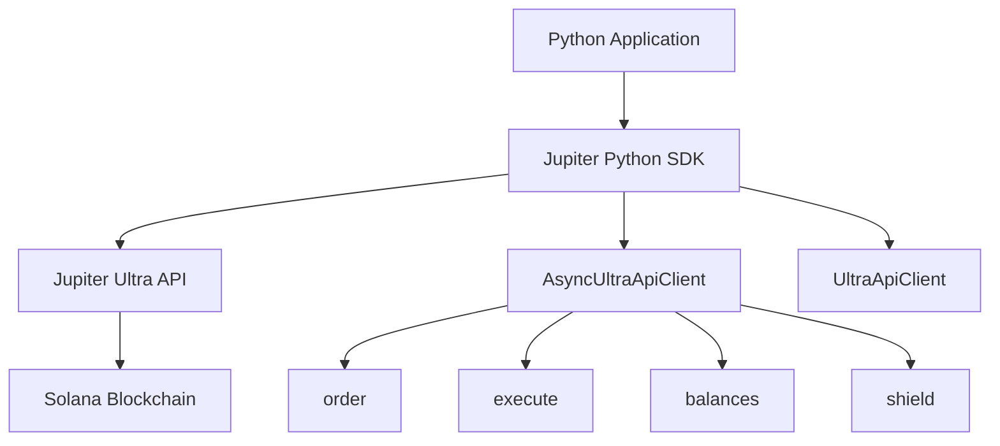

# Jupiter Python SDK

[](https://badge.fury.io/py/pyjupiter)
[](https://pypi.org/project/pyjupiter/)
[](https://opensource.org/licenses/MIT)

A high-performance, async-first Python SDK for seamless interaction with the Jupiter Ultra API, powered by `curl_cffi`
for maximum speed and flexibility.

With Ultra API, you don't need to manage or connect to any RPC endpoints, or deal with complex configurations.
Everything from getting quotes to transaction execution happens directly through a powerful API.

Or as we like to say around here: **"RPCs are for NPCs."**

## 🚀 Key Features

| Feature                       | Description                                         |
| ----------------------------- | --------------------------------------------------- |
| ⚡ **High Performance**       | Built on `curl_cffi` for blazing-fast HTTP requests |
| 🔄 **Async/Sync Support**     | Both asynchronous and synchronous clients available |
| 🛡️ **Token Safety**           | Built-in shield API for token security warnings     |
| 💰 **Balance Checking**       | Easy balance retrieval for any Solana address       |
| 🔧 **Advanced Configuration** | Support for proxies, custom DNS, and more           |
| 📦 **Type Safety**            | Full type hints with Pydantic models                |
| 🎯 **Zero Configuration**     | Works out of the box with minimal setup             |

## 🌟 What Makes Jupiter Python SDK Special?

- **Ultra API Integration**: Direct access to Jupiter's powerful trading infrastructure
- **No RPC Management**: Forget about RPC endpoints, node management, and complex configurations
- **Developer-Friendly**: Intuitive API design with comprehensive error handling
- **Production-Ready**: Built for high-frequency trading and enterprise applications
- **Flexible**: Support for both async and sync programming patterns

## 📋 Requirements

- Python 3.9 or higher
- A Solana wallet private key (for transaction signing)

## 🎯 Use Cases

- **DeFi Applications**: Build sophisticated DeFi applications with token swapping
- **Trading Bots**: Create automated trading strategies on Solana
- **Portfolio Management**: Track and manage token balances across multiple wallets
- **Token Analysis**: Analyze token safety and market data
- **Arbitrage Systems**: Build arbitrage bots using Jupiter's liquidity

## 🏗️ Architecture



## 📚 Documentation Navigation

| Section                               | Description                              |
| ------------------------------------- | ---------------------------------------- |
| [Getting Started](getting-started.md) | Installation, setup, and your first swap |
| [API Reference](api-reference.md)     | Complete API documentation with examples |
| [Examples](examples.md)               | Real-world code examples and use cases   |

## 🚀 Quick Example

```python
import asyncio
from pyjupiter.clients.ultra_api_client import AsyncUltraApiClient
from pyjupiter.models.ultra_api.ultra_order_request_model import UltraOrderRequest

async def main():
    # Initialize the async client
    client = AsyncUltraApiClient()

    # Create a swap order
    order_request = UltraOrderRequest(
        input_mint="So11111111111111111111111111111111111111112",  # WSOL
        output_mint="EPjFWdd5AufqSSqeM2qN1xzybapC8G4wEGGkZwyTDt1v",  # USDC
        amount=10000000,  # 0.01 WSOL
        taker=await client.get_public_key(),
    )

    try:
        # Execute the swap
        response = await client.order_and_execute(order_request)
        print(f"✅ Transaction: https://solscan.io/tx/{response['signature']}")
    finally:
        await client.close()

asyncio.run(main())
```

## 🤝 Community & Support

- **GitHub**: [pyjupiter Repository](https://github.com/solanab/pyjupiter)
- **Discord**: [Jupiter Community](https://discord.gg/jup)
- **Documentation**: [Ultra API Docs](https://dev.jup.ag/docs/ultra-api/)
- **API Portal**: [Get Your API Key](https://portal.jup.ag/onboard)

## 📝 License

This project is licensed under the MIT License - see the [LICENSE](../LICENSE) file for details.

---

**Ready to get started?** Check out our [Getting Started Guide](getting-started.md) to begin building with Jupiter
Python SDK!
