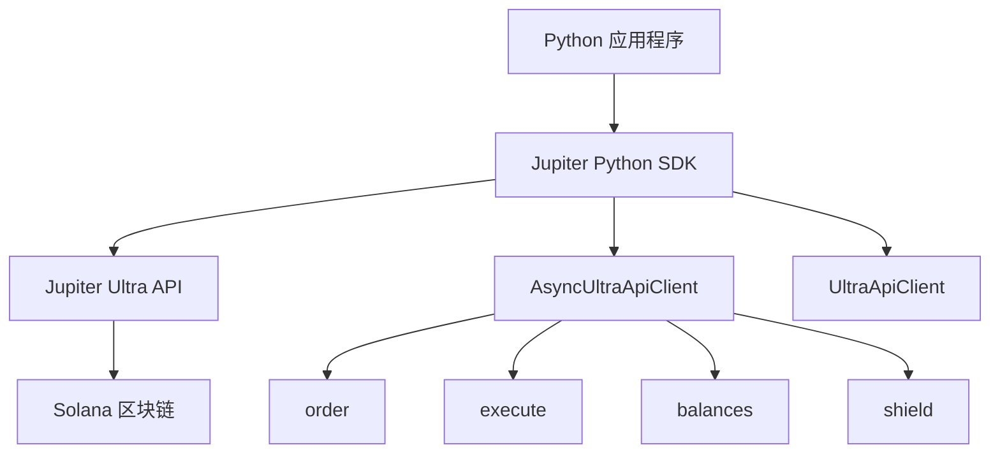

# Jupiter Python SDK

[](https://badge.fury.io/py/pyjupiter)
[](https://pypi.org/project/pyjupiter/)
[](https://opensource.org/licenses/MIT)

基于 `curl_cffi` 构建的高性能、异步优先的 Python SDK，用于与 Jupiter Ultra API 无缝交互，提供最大的速度和灵活性。

使用 Ultra
API，您无需管理或连接任何 RPC 端点，也无需处理复杂的配置。从获取报价到交易执行的所有操作都直接通过强大的 API 完成。

正如我们常说的：**"RPC 是给菜鸟用的。"**

## 🚀 核心特性

| 特性                 | 描述                                      |
| -------------------- | ----------------------------------------- |
| ⚡ **高性能**        | 基于 `curl_cffi` 构建，提供极速 HTTP 请求 |
| 🔄 **异步/同步支持** | 提供异步和同步客户端                      |
| 🛡️ **代币安全**      | 内置盾牌 API，提供代币安全警告            |
| 💰 **余额查询**      | 轻松获取任何 Solana 地址的余额            |
| 🔧 **高级配置**      | 支持代理、自定义 DNS 等                   |
| 📦 **类型安全**      | 使用 Pydantic 模型提供完整的类型提示      |
| 🎯 **零配置**        | 开箱即用，最小化设置                      |

## 🌟 Jupiter Python SDK 的独特之处

- **Ultra API 集成**：直接访问 Jupiter 强大的交易基础设施
- **无需 RPC 管理**：忘记 RPC 端点、节点管理和复杂配置
- **开发者友好**：直观的 API 设计，全面的错误处理
- **生产就绪**：专为高频交易和企业应用而构建
- **灵活性**：支持异步和同步编程模式

## 📋 环境要求

- Python 3.9 或更高版本
- Solana 钱包私钥（用于交易签名）

## 🎯 使用场景

- **DeFi 应用**：构建具有代币交换功能的复杂 DeFi 应用
- **交易机器人**：在 Solana 上创建自动化交易策略
- **投资组合管理**：跨多个钱包跟踪和管理代币余额
- **代币分析**：分析代币安全性和市场数据
- **套利系统**：使用 Jupiter 的流动性构建套利机器人

## 🏗️ 架构图



## 📚 文档导航

| 章节                              | 描述                       |
| --------------------------------- | -------------------------- |
| [快速开始](getting-started.zh.md) | 安装、设置和您的第一次交换 |
| [API 参考](api-reference.zh.md)   | 完整的 API 文档和示例      |
| [代码示例](examples.zh.md)        | 真实世界的代码示例和用例   |

## 🚀 快速示例

```python
import asyncio
from pyjupiter.clients.ultra_api_client import AsyncUltraApiClient
from pyjupiter.models.ultra_api.ultra_order_request_model import UltraOrderRequest

async def main():
    # 初始化异步客户端
    client = AsyncUltraApiClient()

    # 创建交换订单
    order_request = UltraOrderRequest(
        input_mint="So11111111111111111111111111111111111111112",  # WSOL
        output_mint="EPjFWdd5AufqSSqeM2qN1xzybapC8G4wEGGkZwyTDt1v",  # USDC
        amount=10000000,  # 0.01 WSOL
        taker=await client.get_public_key(),
    )

    try:
        # 执行交换
        response = await client.order_and_execute(order_request)
        print(f"✅ 交易链接: https://solscan.io/tx/{response['signature']}")
    finally:
        await client.close()

asyncio.run(main())
```

## 🤝 社区与支持

- **GitHub**：[pyjupiter 仓库](https://github.com/solanab/pyjupiter)
- **Discord**：[Jupiter 社区](https://discord.gg/jup)
- **文档**：[Ultra API 文档](https://dev.jup.ag/docs/ultra-api/)
- **API 门户**：[获取您的 API 密钥](https://portal.jup.ag/onboard)

## 📝 许可证

本项目采用 MIT 许可证 - 详情请参阅 [LICENSE](../LICENSE) 文件。

---

**准备开始了吗？** 查看我们的[快速开始指南](getting-started.zh.md)，开始使用 Jupiter Python SDK 构建应用！
